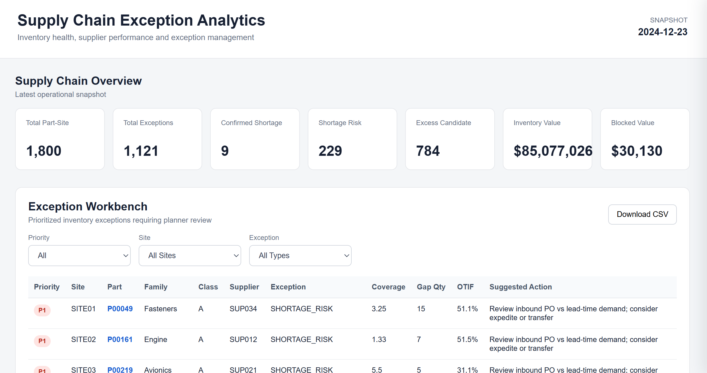
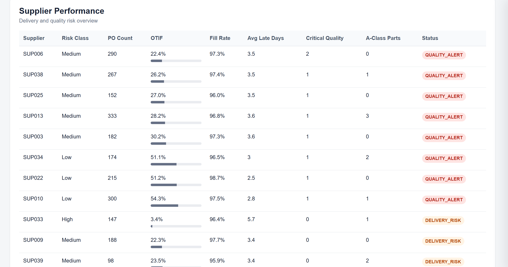
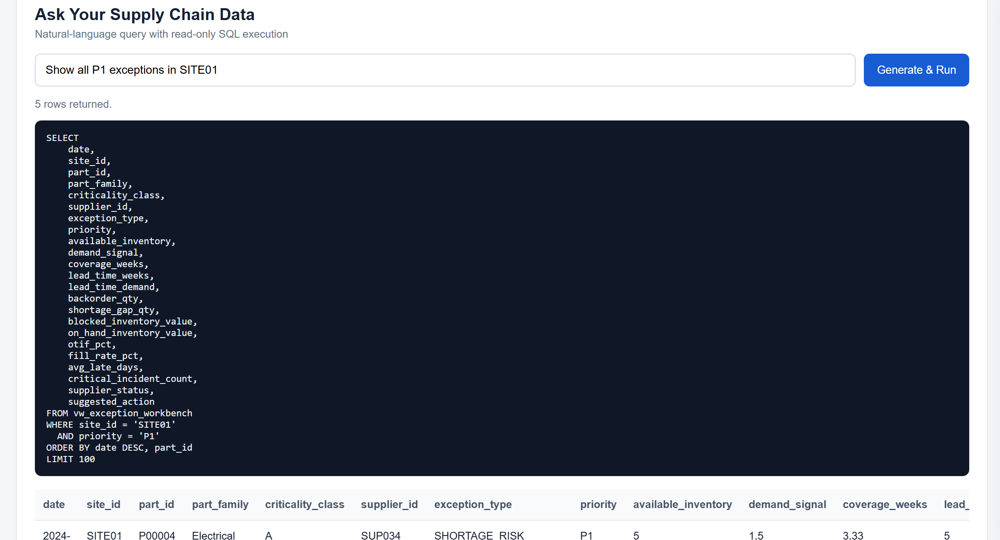
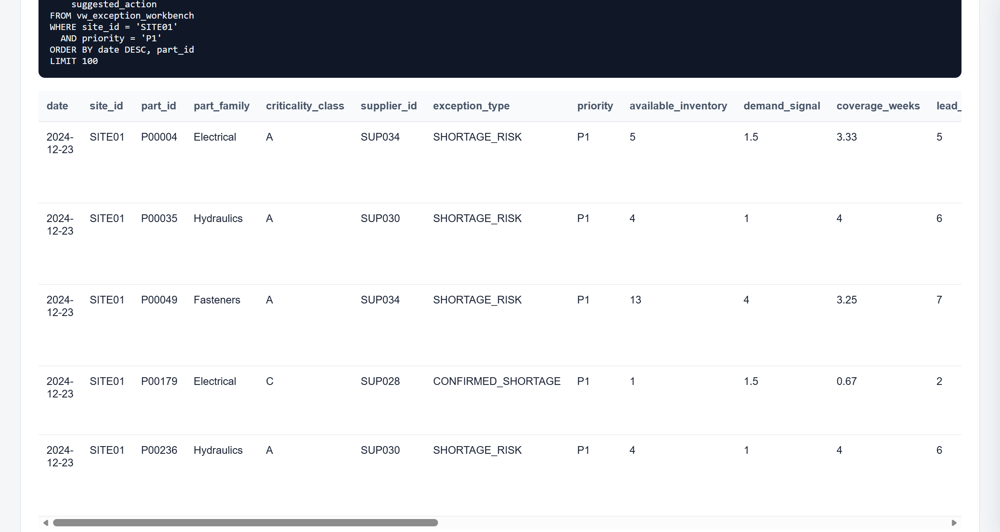

# Supply Chain Exception Analytics  
# 供应链异常分析与管理

A supply chain analytics demo for inventory health monitoring, supplier performance analysis, exception prioritization, and natural-language data querying.

一个面向供应链计划与异常管理场景的数字化分析项目，整合库存、需求、采购订单及供应商质量数据，通过 PostgreSQL、SQL、FastAPI 和 Web Dashboard 实现异常识别、优先级管理、供应商履约分析、物料下钻及自然语言数据查询。

> 本项目使用模拟数据进行作品集展示，不包含任何敏感数据。数据来源：kaggle公开数据https://www.kaggle.com/datasets/robertocarlost/aerospace-supply-chain-performance-and-forecasting

---

## 1. Project Overview / 项目概述

Supply-chain planners often work with large volumes of inventory, demand, purchase order, and supplier data. Raw operational data alone does not directly answer questions such as:

- Which parts require immediate attention?
- Which shortages are already confirmed?
- Which materials may run short before replenishment arrives?
- Which suppliers have poor delivery or quality performance?
- What action should planners review first?

This project converts raw supply-chain records into a prioritized exception workflow.

供应链计划工作中往往同时存在大量库存、需求、采购订单和供应商数据，但原始数据本身很难直接回答：

- 哪些物料需要优先处理？
- 哪些物料已经发生缺货？
- 哪些物料可能在补货到达前产生短缺？
- 哪些供应商存在交付或质量风险？
- 计划人员下一步应该优先检查什么？

因此，本项目将多表供应链数据整理为可查询、可筛选、可追溯的异常管理工作台。

---

## 2. Architecture / 项目架构

```text
Public Synthetic CSV Data
        ↓
Python / Pandas ETL
        ↓
PostgreSQL
        ↓
SQL Business Views
        ↓
FastAPI
        ↓
REST API / JSON
        ↓
HTML + CSS + JavaScript Dashboard
        ↓
Exception Monitoring / Drill-down / Text-to-SQL
```

The project separates data processing, business logic, API access, and presentation into different layers.

项目将数据处理、业务计算、API 和前端展示分层设计，便于后续独立修改业务规则或页面展示。

---

## 3. Data Model / 数据模型

The PostgreSQL database contains six core tables.

PostgreSQL 中建立 6 张核心关系表。

### Dimension Tables / 维度表

- `dim_part` — Part master / 物料主数据
- `dim_supplier` — Supplier master / 供应商主数据
- `dim_site` — Site master / 工厂或站点主数据

### Fact Tables / 事实表

- `fact_supply_weekly` — Weekly inventory, demand and forecast data / 周度库存、需求与预测
- `fact_purchase_order` — Purchase order and receipt records / 采购订单及收货记录
- `fact_quality_incident` — Supplier quality incidents / 供应商质量事件

The ETL pipeline loads and validates more than 300,000 operational records into PostgreSQL.

Python ETL 将多份 CSV 清洗、转换并写入 PostgreSQL，形成超过 30 万条业务记录的数据底座。

---

## 4. Core Business Views / 核心业务视图

Three SQL analytical views are built on top of the relational tables.

在基础数据表之上建立三个核心 SQL 业务视图。

### `vw_inventory_health`

Calculates inventory health and shortage / excess indicators.

用于计算库存健康度及缺货、过量库存候选指标。

Key indicators include:

- Available Inventory
- 4-Week Average Consumption
- Demand Signal
- Coverage Weeks
- Lead-Time Demand
- Shortage Gap
- Excess Candidate
- Inventory Status

---

### `vw_supplier_performance`

Evaluates supplier delivery and quality performance.

用于评估供应商交付表现和质量风险。

Key indicators include:

- On-Time %
- In-Full %
- OTIF
- Fill Rate
- Average Late Days
- Quality Incident Count
- Critical Quality Incident Count
- Supplier Status

---

### `vw_exception_workbench`

Combines inventory risk and supplier performance into a prioritized exception list.

将库存风险与供应商表现进行整合，形成计划人员可直接处理的异常列表。

Each exception includes:

- Priority
- Site
- Part
- Part Family
- Criticality
- Supplier
- Exception Type
- Coverage
- Shortage Gap
- OTIF
- Suggested Action

---

## 5. Business Rules / 业务规则

### Available Inventory / 可用库存

```text
Available Inventory
= On Hand Inventory - Blocked Inventory
```

---

### Demand Signal / 需求信号

```text
Demand Signal
= max(Current Forecast, 4-Week Average Consumption)
```

The demo uses the higher value between forecast and recent consumption as a conservative shortage-risk signal.

项目 Demo 在预测与近期平均消耗之间取较高值，以降低需求低估导致的缺货风险。

---

### Lead-Time Demand / 提前期需求

```text
Lead-Time Demand
= Demand Signal × Lead Time Weeks
```

This estimates demand before replenishment can arrive.

用于估计新一批供应到达前可能发生的需求量。

---

### Confirmed Shortage / 已确认缺货

```text
Backorder Qty > 0
```

---

### Shortage Risk / 缺货风险

```text
Available Inventory < Lead-Time Demand
```

---

### Coverage Weeks / 库存覆盖周数

```text
Coverage Weeks
= Available Inventory / Weekly Demand Signal
```

---

### Excess Candidate / 过量库存候选

```text
Coverage Weeks >= 12
```

The 12-week threshold is a configurable demo rule rather than a universal supply-chain standard.

12 周仅作为项目 Demo 中的可配置业务阈值，并非通用供应链标准。

In a production environment, safety stock, MOQ, lifecycle, service level, seasonality and company-specific planning policies should also be considered.

真实企业应用中还需要结合安全库存、MOQ、生命周期、服务水平、季节性及企业自身计划规则进行调整。

---

## 6. Exception Priority / 异常优先级

The Exception Workbench assigns P1 / P2 / P3 priorities.

异常工作台根据业务风险将异常划分为 P1 / P2 / P3。

Example logic:

- `P1` — Confirmed shortages or critical A-class shortage risks
- `P2` — Other shortage risks or important blocked-stock issues
- `P3` — Excess, no-demand inventory and lower-priority exceptions

The objective is not only to show exceptions, but to help planners identify what should be reviewed first.

项目重点并非单纯展示异常数量，而是帮助计划人员快速确定优先处理顺序。

---

## 7. Dashboard Features / 页面功能

### Supply Chain Overview / 供应链概览

The dashboard summarizes the latest operational snapshot, including:

- Total Part-Site combinations
- Total Exceptions
- Confirmed Shortages
- Shortage Risks
- Excess Candidates
- Inventory Value
- Blocked Inventory Value



---

### Exception Workbench / 异常工作台

Users can filter exceptions by:

- Priority
- Site
- Exception Type

The table displays business indicators and suggested actions for planner review.

支持按照优先级、站点及异常类型进行筛选，并展示：

- 物料
- 产品族
- 关键等级
- 供应商
- Coverage
- Shortage Gap
- OTIF
- Suggested Action

Filtered results can also be exported to CSV.

---

### Supplier Performance / 供应商履约分析

Supplier delivery and quality performance is summarized using OTIF, Fill Rate, late delivery and quality indicators.

通过 OTIF、Fill Rate、平均延迟天数和质量事件等指标分析供应商表现。



---

## 8. Part Drill-down / 物料下钻

Users can click a Part ID from the Exception Workbench to review detailed information for the selected Site-Part combination.

点击异常工作台中的物料后，可以进一步查看：

- Part Master Data / 物料主数据
- Current Inventory Health / 当前库存状态
- Supplier Performance / 供应商表现
- Recent Inventory History / 近期库存与需求历史
- Recent Purchase Orders / 近期采购订单

The Site-Part combination is used because the same material may have different inventory conditions at different sites.

同一物料在不同 Site 的库存和需求状态可能不同，因此下钻分析采用 `Site + Part` 作为业务粒度。

---

## 9. Text-to-SQL / 自然语言数据查询

The dashboard includes an LLM-assisted Text-to-SQL module.

页面集成大模型辅助的 Text-to-SQL 功能，业务用户可以直接使用自然语言查询供应链数据。

Example:

```text
Show all P1 exceptions in SITE01
```

The system converts the question into PostgreSQL SQL and displays the generated SQL before returning the result.

系统根据预定义数据库 Schema 生成 PostgreSQL 查询，并展示 SQL Preview 和查询结果。





---

## 10. Text-to-SQL Safety / SQL 安全控制

The LLM does not directly control the database.

大模型本身不直接拥有数据库操作权限。

The execution flow is:

```text
Natural Language Question
        ↓
LLM
        ↓
Generated SQL
        ↓
SQL Validator
        ↓
Read-Only Transaction
        ↓
PostgreSQL
        ↓
Query Results
```

Safety controls include:

- Only `SELECT` and `WITH` queries are accepted
- `INSERT`, `UPDATE`, `DELETE`, `DROP`, `ALTER`, `TRUNCATE`, `CREATE` and other write operations are blocked
- Multiple SQL statements are rejected
- Database execution uses a read-only transaction
- Query result size is limited
- Generated SQL is shown before the result

安全控制包括：

- 仅允许 `SELECT` 和 `WITH`
- 拦截增删改表及其他写操作
- 禁止一次执行多条 SQL
- 使用 PostgreSQL Read-Only Transaction
- 限制返回数据规模
- 页面展示 Generated SQL，便于人工检查

---

## 11. API Layer / API 接口

FastAPI provides the data access layer between the frontend and PostgreSQL.

FastAPI 作为前端和 PostgreSQL 之间的数据接口层。

Main endpoints include:

```text
GET  /api/health
GET  /api/overview
GET  /api/exceptions
GET  /api/suppliers
GET  /api/sites
GET  /api/parts/{part_id}
POST /api/ask
```

Example:

```text
GET /api/exceptions?priority=P1&site_id=SITE01
```

returns filtered exception records without requiring the frontend to directly connect to PostgreSQL.

前端仅通过 HTTP 请求访问 FastAPI，不直接暴露数据库账号或密码。

---

## 12. Tech Stack / 技术栈

### Data & Database

- Python
- Pandas
- PostgreSQL
- SQL
- SQLAlchemy

### Backend

- FastAPI
- Uvicorn
- REST API
- JSON

### Frontend

- HTML
- CSS
- JavaScript

### AI

- DeepSeek API
- Schema-guided Text-to-SQL
- SQL Validation
- Read-only SQL Execution

### Development

- VS Code
- DBeaver
- Git
- GitHub

---

## 13. Project Structure / 项目结构

```text
01-supply-chain-analytics/
│
├── backend/
│   ├── main.py
│   ├── database.py
│   └── text_to_sql.py
│
├── frontend/
│   ├── index.html
│   ├── styles.css
│   └── app.js
│
├── etl/
│   ├── 00_test_database_connection.py
│   └── 01_load_to_postgres.py
│
├── sql/
│   ├── 01_schema.sql
│   ├── 02_validation_queries.sql
│   ├── 03_inventory_health.sql
│   ├── 04_supplier_performance.sql
│   └── 05_exception_workbench.sql
│
├── docs/
│   └── business_rules.md
│
├── screenshots/
│   ├── 01_dashboard_overview.png
│   ├── 02_supplier_performance.png
│   ├── 03_text_to_sql_query.png
│   └── 04_text_to_sql_results.png
│
├── .env.example
├── requirements.txt
└── README.md
```

---

## 14. Running the Project / 本地运行

### 1. Install dependencies

```bash
pip install -r requirements.txt
```

### 2. Configure environment variables

Create a `.env` file based on `.env.example`.

Example:

```text
DB_HOST=localhost
DB_PORT=5432
DB_NAME=supply_chain_analytics
DB_USER=your_username
DB_PASSWORD=your_password

DEEPSEEK_API_KEY=your_api_key
DEEPSEEK_MODEL=deepseek-v4-flash
```

Do not commit `.env` to GitHub.

---

### 3. Create PostgreSQL tables

Execute:

```text
sql/01_schema.sql
```

in PostgreSQL / DBeaver.

---

### 4. Load source data

```bash
python etl/01_load_to_postgres.py
```

---

### 5. Create analytical views

Execute:

```text
03_inventory_health.sql
04_supplier_performance.sql
05_exception_workbench.sql
```

---

### 6. Start FastAPI

```bash
python -m uvicorn backend.main:app --reload
```

---

### 7. Open Dashboard

```text
http://127.0.0.1:8000/dashboard
```

API documentation:

```text
http://127.0.0.1:8000/docs
```

---

## 15. What I Learned / 项目实践内容

Through this project, I practiced the full workflow from raw operational data to a usable supply-chain application:

通过本项目完成了从原始供应链数据到可交互数字化应用的完整链路，包括：

- Multi-table data modeling / 多表关系建模
- Python ETL / Python 数据清洗与入库
- PostgreSQL database design / PostgreSQL 数据库设计
- SQL JOIN and Window Functions / SQL JOIN 与窗口函数
- Business-rule-based analytical views / SQL 业务视图
- Supply-chain exception logic / 供应链异常规则
- FastAPI backend development / FastAPI 后端接口
- REST API and JSON / API 数据交互
- HTML / JavaScript dashboard / 前端交互页面
- Part-level drill-down / 物料级下钻
- CSV export / 查询结果导出
- LLM-assisted Text-to-SQL / 大模型辅助自然语言查询
- Git / GitHub version control / Git 版本管理

---

## 16. Limitations / 项目局限

This project is designed as a portfolio demo rather than a production planning system.

本项目定位为供应链数字化作品集 Demo，而非正式生产计划系统。

Current limitations include:

- Synthetic rather than enterprise production data
- Simplified inventory and shortage rules
- Fixed demonstration thresholds
- No safety-stock optimization
- No MOQ / lot-size constraints
- No ERP or APS real-time integration
- No user authentication or role management

A production implementation would require company-specific planning rules, master-data governance, security controls, ERP integration and business validation.

若应用于真实企业环境，还需要结合企业特定计划规则、主数据治理、权限体系、ERP/APS 接口及业务验证进一步完善。

---

## 17. Future Improvements / 后续可扩展方向

Potential improvements include:

- Configurable business-rule thresholds
- Additional shortage and supplier risk rules
- Role-based access control
- Scheduled ETL jobs
- ERP / APS / WMS API integration
- Deployment to a cloud environment
- Additional visualization and trend analysis

---

## Disclaimer / 说明

This project is independently developed for learning and portfolio demonstration purposes using public synthetic data.

